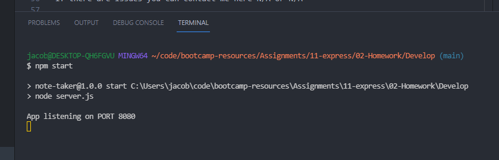

# 11 - Note Taker

Jacob Hegan UWA Full Stack Flex Bootcamp - February 2021

[](https://choosealicense.com/licenses/mit/)

---

[Heroku Link](https://floating-plateau-50769.herokuapp.com/)

[Repository Link](https://github.com/heganjr/11-express-note-taker-JH)

---

## Description

```
GIVEN a note-taking application
WHEN I open the Note Taker
THEN I am presented with a landing page with a link to a notes page
WHEN I click on the link to the notes page
THEN I am presented with a page with existing notes listed in the left-hand column, plus empty fields to enter a new note title and the note’s text in the right-hand column
WHEN I enter a new note title and the note’s text
THEN a Save icon appears in the navigation at the top of the page
WHEN I click on the Save icon
THEN the new note I have entered is saved and appears in the left-hand column with the other existing notes
WHEN I click on an existing note in the list in the left-hand column
THEN that note appears in the right-hand column
WHEN I click on the Write icon in the navigation at the top of the page
THEN I am presented with empty fields to enter a new note title and the note’s text in the right-hand column
```

Please keep in mind no delete note feature is added. Was unable to do this and will enable this in a future update.

## Table of Contents

- [Installation](#installation)
- [Usage](#usage)
- [Credits](#credits)
- [License](#license)

## Installation

- npm install - in the command line/terminal within the file directory if cloned to your local machine

- npm start

- Go to http://localhost:8080/


## Usage

Upon launching the application either at the Heroku link or on http://localhost:8080/

1. Create a note by typing in the Note Title and Note Text then clicking on the save icon.

2. View created notes on the left and click to access those notes

3. Delete notes by clicking on the red bin icon

***Delete not working at this time***


### Screenshot



---

## Credits

[Jacob Hegan](https://github.com/heganjr)

---

## License

[MIT License](https://choosealicense.com/licenses/mit/)


  Copyright (c) [2021] [Jacob Hegan]
  
  Permission is hereby granted, free of charge, to any person obtaining a copy
  of this software and associated documentation files (the "Software"), to deal
  in the Software without restriction, including without limitation the rights
  to use, copy, modify, merge, publish, distribute, sublicense, and/or sell
  copies of the Software, and to permit persons to whom the Software is
  furnished to do so, subject to the following conditions:
  
  The above copyright notice and this permission notice shall be included in all
  copies or substantial portions of the Software.
  
  THE SOFTWARE IS PROVIDED "AS IS", WITHOUT WARRANTY OF ANY KIND, EXPRESS OR
  IMPLIED, INCLUDING BUT NOT LIMITED TO THE WARRANTIES OF MERCHANTABILITY,
  FITNESS FOR A PARTICULAR PURPOSE AND NONINFRINGEMENT. IN NO EVENT SHALL THE
  AUTHORS OR COPYRIGHT HOLDERS BE LIABLE FOR ANY CLAIM, DAMAGES OR OTHER
  LIABILITY, WHETHER IN AN ACTION OF CONTRACT, TORT OR OTHERWISE, ARISING FROM,
  OUT OF OR IN CONNECTION WITH THE SOFTWARE OR THE USE OR OTHER DEALINGS IN THE
  SOFTWARE.

---
